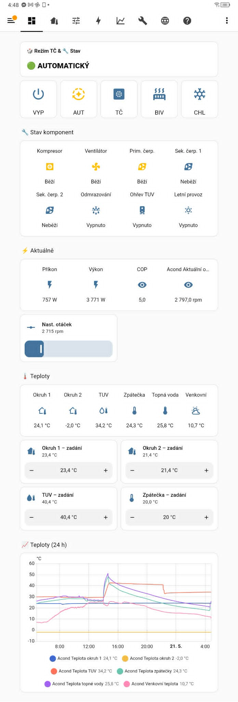
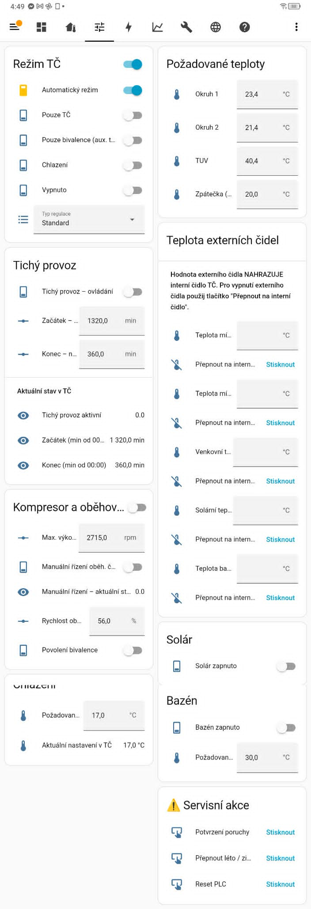
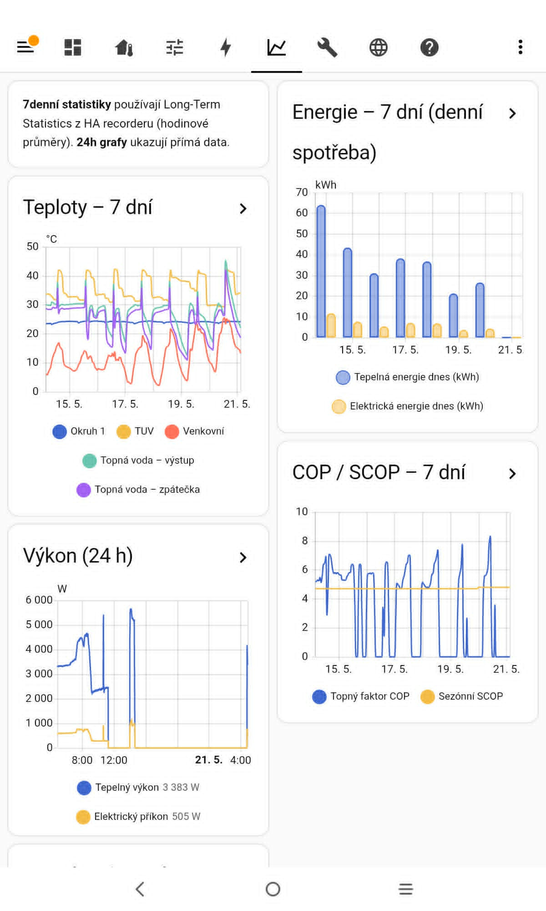
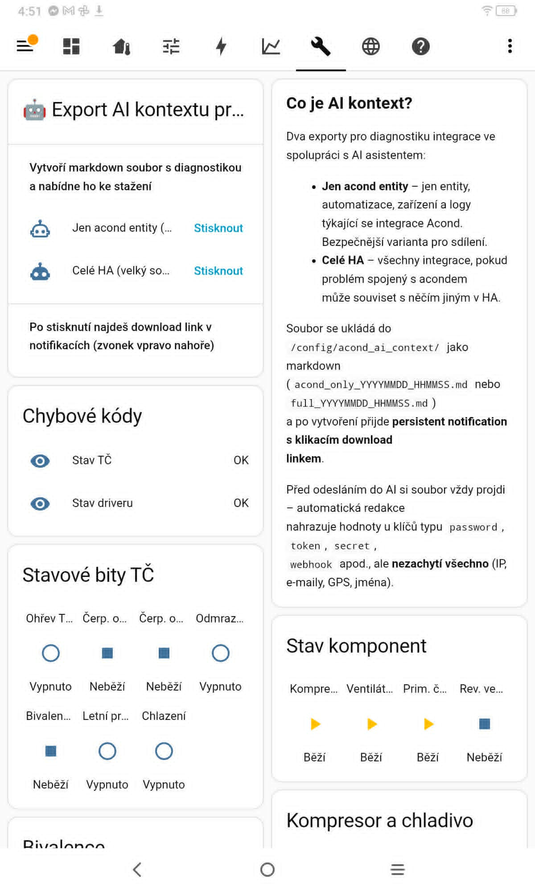
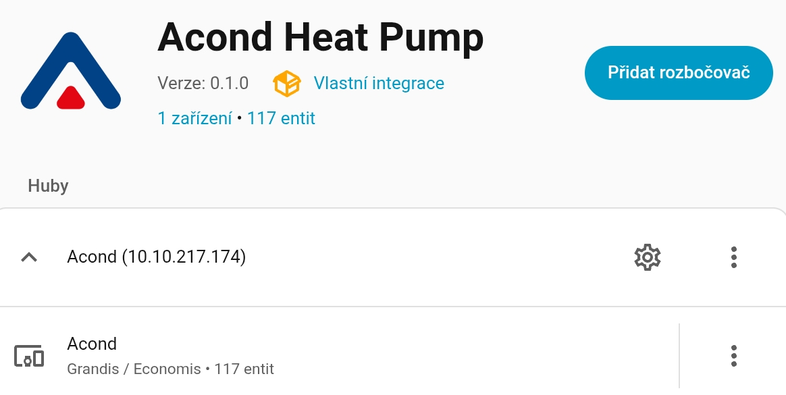
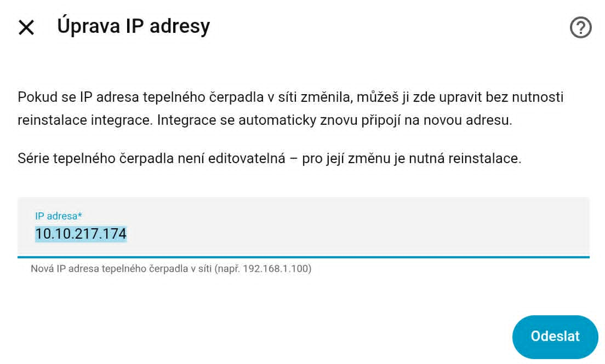
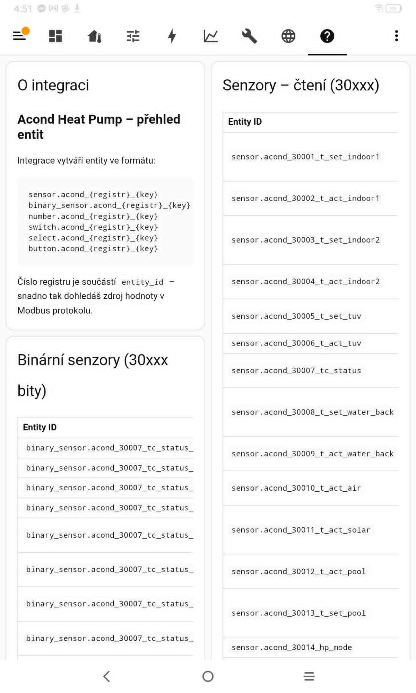
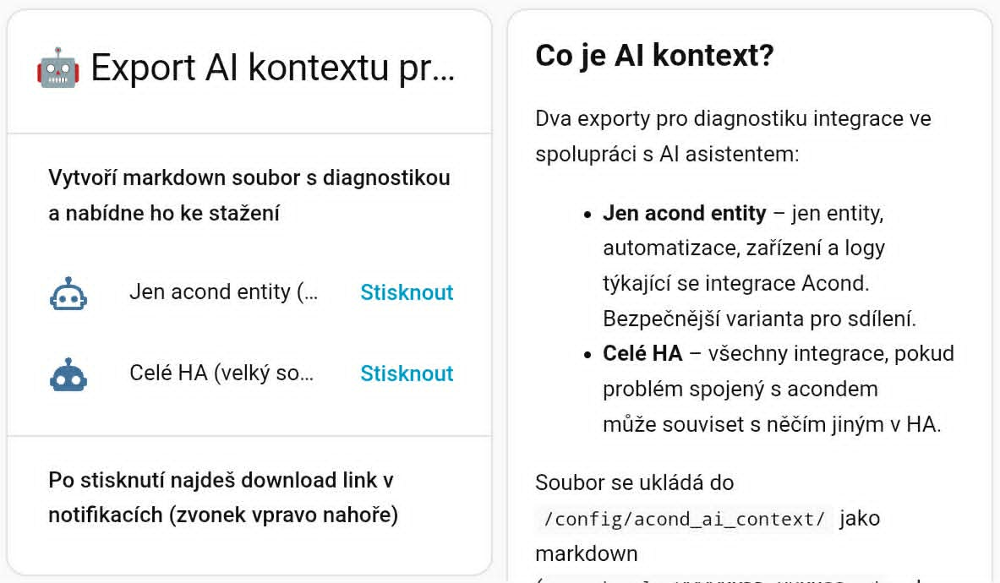

# Acond Heat Pump – Home Assistant integrace

> 🇬🇧 **This documentation is also available in English:** [README.md](README.md)

---

## ⚠️ Beta verze

Integrace je momentálně v beta fázi (v0.1.0). Byla vyvinuta a otestována na reálném hardware, ale ještě nebyla ověřena širší uživatelskou základnou. **Očekávejte občasné chyby a změny rozhraní** až do verze v1.0.0. Chyby prosím hlaste na [stránce Issues](https://github.com/pavorlechre/homeassistant-acond/issues).

---

## Disclaimer

Toto je neoficiální komunitní integrace. Není přidružená, schválená ani podporovaná společností Acond a.s. Název "Acond" a logo jsou použity výhradně k identifikaci tepelných čerpadel, se kterými integrace komunikuje.

---

## Co integrace umí

Custom integrace pro Home Assistant pro **tepelná čerpadla Acond** komunikující přes **Modbus TCP**. Integrace zpřístupňuje senzory a ovládací prvky tepelného čerpadla jako nativní entity Home Assistant, automaticky vytvoří Lovelace dashboard a funguje bez jakékoli YAML konfigurace.

## Funkce

- **Nulová YAML konfigurace** – stačí zadat IP adresu tepelného čerpadla
- **115+ entit** – senzory pro čtení i ovládací entity pro zápis (mění chování TČ)
- **Obousměrné ovládání** – výběr režimů, setpointy, tichý provoz, bivalence
- **Auto-generovaný Lovelace dashboard** – nainstalován a připraven ihned po nastavení
- **Vícejazyčné rozhraní** – čeština a angličtina (config flow + názvy entit)
- **Podpora sérií** – Grandis / Economis a PRO
- **AI kontext** – jedním kliknutím vygeneruješ markdown soubor pro AI asistenta s aktuálním stavem HA (diagnostika poruch, generování YAML)
- **Disciplinovaný Modbus master** – persistentní TCP spojení, polling každých 15 sekund
- **Vestavěné dekódování chyb** – číselné chybové kódy přeloženy do čitelného textu
- **Žádné externí frontend závislosti** – používá pouze vestavěné karty Home Assistant

---

## Náhledy

Integrace přináší kompletní vícepohledový Lovelace dashboard (**ACOND TČ**), vygenerovaný automaticky při instalaci:

<table>
  <tr>
    <td align="center" width="50%">
       
      <b>Pohled</b> — režimy, stav komponent, aktuální výkon a COP, teploty
    </td>
    <td align="center" width="50%">
       
      <b>Ovládání</b> — setpointy, režimy, tichý provoz, externí čidla
    </td>
  </tr>
  <tr>
    <td align="center" width="50%">
       
      <b>Grafy</b> — průběhy teplot, výkonu, energie a COP
    </td>
    <td align="center" width="50%">
       
      <b>Diagnostika</b> — export AI kontextu, chybové kódy, stavové bity
    </td>
  </tr>
</table>

---

## Požadavky

- Home Assistant **2024.11.0** nebo novější
- Nainstalovaný HACS
- Tepelné čerpadlo Acond s **aktivní Modbus TCP komunikací** (port 502)
- **Žádný jiný Modbus TCP klient** – Acond přijímá pouze jednoho mastera současně. Pokud máš v `configuration.yaml` blok `modbus:`, **odstraň ho před instalací**. Stejně tak externí systémy připojené přes Modbus TCP (např. Loxone) musí být odpojeny.

---

## Instalace

### Přes HACS (doporučeno)

1. V HACS otevři **Integrace** → **⋮ menu** → **Vlastní repozitáře**
2. Přidej URL repa: `https://github.com/pavorlechre/homeassistant-acond`
3. Kategorie: **Integrace**
4. Klikni **Přidat**
5. Najdi **Acond Heat Pump** v seznamu HACS integrací a klikni **Stáhnout**
6. Restartuj Home Assistant

### Ruční instalace

1. Stáhni obsah složky `custom_components/acond/` z tohoto repozitáře
2. Zkopíruj ji do `<config>/custom_components/acond/` v konfiguraci Home Assistant
3. Restartuj Home Assistant

---

## Konfigurace

Po instalaci:

1. Jdi do **Nastavení** → **Zařízení a služby** → **Přidat integraci**
2. Vyhledej **Acond Heat Pump**
3. Vyplň:
   - **IP adresa** – IP adresa tepelného čerpadla v síti (např. `192.168.1.100`)
   - **Série tepelného čerpadla** – `Grandis / Economis` nebo `PRO`
4. Klikni **Odeslat**

Integrace se připojí k tepelnému čerpadlu, vytvoří všechny entity a zaregistruje nový dashboard panel (**ACOND TČ**) v bočním menu HA.

Po dokončení nastavení se integrace objeví v **Nastavení → Zařízení a služby** jako jedno zařízení se všemi entitami:

  

### Nastavení Modbus timeoutu

Interní Modbus timeout tepelného čerpadla musí být nastaven na **minimálně 4 minuty 30 sekund**, aby polling integrace každých 15 sekund nezpůsobil odpojení. Nastav to přímo na panelu tepelného čerpadla.

### Změna IP adresy později

Pokud se IP adresa tepelného čerpadla změní (např. po výměně routeru), **není** potřeba integraci přeinstalovávat. Otevři dialog **Konfigurovat** u integrace a uprav adresu – integrace se automaticky znovu připojí.

  

---

## Poskytnuté entity

Integrace vytvoří přibližně **115+ entit** napříč šesti platformami. Jsou rozděleny na **čtecí** (zobrazují stav TČ) a **ovládací** (zapisují do registrů 400xx, mění chování TČ).

### Čtecí entity

| Platforma | Počet | Účel |
|---|---|---|
| `sensor` | ~64 | Teploty, výkon, COP, energie, runtime, stav |
| `binary_sensor` | 17 | Bity stavu TČ a indikátory běhu komponent |

### Ovládací entity (zápis do 400xx)

| Platforma | Počet | Účel |
|---|---|---|
| `number` | ~15 | Setpointy (TUV, zpátečka, teplota bivalence, výkon, korekce externích čidel) |
| `switch` | ~10 | Režimové přepínače (jen topení, chlazení, solár, bazén, bivalence, tichý provoz) |
| `select` | 1 | Typ regulace |
| `button` | ~8 | Potvrzení poruchy, přepínač léto/zima, reset PLC, generátor AI kontextu |

Všechny entity jsou seskupeny pod jedním zařízením nazvaným *Acond* a číslo Modbus registru je součástí `entity_id` pro snadnou identifikaci (např. `sensor.acond_30006_t_act_tuv`).

Dashboard obsahuje i vestavěný pohled **Nápověda** s úplným přehledem všech entit a jejich Modbus registrů:

  

---

## AI kontext – pomocník pro AI asistenty

Integrace umí vygenerovat **strukturovaný markdown soubor** s aktuálním stavem tvé Home Assistant instance, který stačí přiložit do chatu s AI (Claude, ChatGPT, ...) – AI okamžitě ví, co máš nakonfigurováno. Užitečné při:

- **Diagnostice poruch** – AI vidí entity, jejich stav, posledních pár řádků logu integrace a globální chyby
- **Pomoci s YAML** – AI zná tvoje entity, automatizace, oblasti, skripty a generuje YAML, který přesně sedí na tvé prostředí

  

### Dva režimy (dostupné jako buttony v zařízení Acond)

| Tlačítko | Co exportuje |
|---|---|
| **Generate AI Context (Acond)** | Pouze Acond entity + automatizace/skripty/scény, které je referencují |
| **Generate AI Context (Full HA)** | Celý Home Assistant – všechny integrace, entity, automatizace |

Po kliknutí se vygeneruje markdown soubor v `/config/www/acond_ai_context/`, dostupný ke stažení odkazem v notifikaci v HA. Soubor pak stačí přiložit do AI chatu.

### Bezpečnost

Před uložením souboru integrace **automaticky redaktuje** hodnoty obsahující `password`, `token`, `api_key`, `secret`, `webhook` a podobné. **Vždy si ale soubor před odesláním AI sám zkontroluj** – automatická redakce nezachytí vše (např. tokeny v komentářích nebo nestandardně pojmenovaná pole).

### Příklad využití: migrace z YAML modbus konfigurace

Pokud přecházíš z existující ručně psané YAML modbus konfigurace na tuto integraci, AI kontext spolu s tvým původním `configuration.yaml` tvoří silný tandem pro automatický mapping starých entit na nové a generování YAML patchů pro postižené automatizace, skripty, šablony a Lovelace karty. Detailní postup je popsán v samostatném dokumentu [MIGRATION.md](MIGRATION.md).

---

## Omezení

- **Žádné SG (Smart Grid) funkce** – Integrace pokrývá pouze registry uvedené v oficiálním Acond Modbus protokolu (AC781150/52). Některé novější funkce (zejména SG ready, dynamické tarify, externí blokování) jsou v některých TČ dostupné, ale **společnost Acond pro ně oficiální Modbus dokumentaci nevydala**. Z principu reverse-engineering neděláme – pokud Acond protokol rozšíří, integrace ho přidá.

---

## Řešení problémů

### Tepelné čerpadlo se nepřipojuje

- Ověř IP adresu a dostupnost portu 502 (`ping` a `telnet <ip> 502`)
- Zkontroluj, že není připojen jiný Modbus TCP master (YAML modbus v `configuration.yaml`, Loxone, atd.)
- Zvyš Modbus timeout na tepelném čerpadle minimálně na 4:30

### Entity jsou `unavailable`

- Starší firmware tepelného čerpadla nemusí podporovat všechny registry – to je normální
- Postižené entity se automaticky aktivují po aktualizaci firmware tepelného čerpadla

### Log zobrazuje probe chyby

- Probe chyby při startu jsou záměrně logovány na úrovni `DEBUG` – ve standardním logu se neobjeví
- Pokud je vidíš na úrovni `ERROR`, zvyš Modbus timeout na tepelném čerpadle

---

## Hlášení chyb

Chyby a návrhy funkcí prosím hlas přes [stránku Issues](https://github.com/pavorlechre/homeassistant-acond/issues). Použij přiložené šablony a uveď:

- Verzi Home Assistant
- Verzi integrace
- Model a verzi firmware tepelného čerpadla
- Relevantní výpisy z logu Home Assistant (ideálně vygenerovaný AI kontext)

---

## Licence

Tento projekt je licencován pod MIT licencí – viz soubor [LICENSE](LICENSE).

---

## Poděkování

- **Claude (Anthropic), model Opus 4.7** – AI asistent, bez kterého by tato integrace nevznikla. Pomohl s návrhem architektury, kódem, dokumentací i s dlouhými diskuzemi o protokolech Modbus, paradigmatech Home Assistantu a UX
- Tým Home Assistant a širší komunita
- Knihovna [pymodbus](https://github.com/pymodbus-dev/pymodbus)
- Přátelé a první testeři, kteří poskytli zpětnou vazbu na reálném hardware

---

## Autor

**Pavel Vorlech** – [@pavorlechre](https://github.com/pavorlechre)
